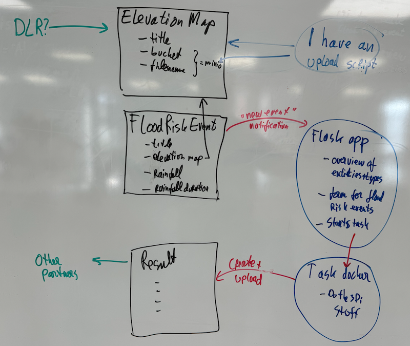

# Implementation & collaboration plan Nelen & Schuurmans

*Note beforehand: the information here is a technical programmer's view of what needs to be done :-) It might not be totally in sync with the project's terminology and plans.*

Within the [EU TEMA project](https://tema-project.eu/), [Nelen & Schuurmans](https://www.nelen-schuurmans.nl) is mainly involved with our [3Di hydrodynamic computation software](https://3diwatermanagement.com/), known as `PDM-tech-02` in the project. Our direct aim is to improve 3Di for disaster management.

Disaster management also means collaboration, of course. For that purpose, TEMA has provided infrastructure and technology suggestions as a framework for collaboration. The implementation plan in this document shows how we want to use the infrastructure to be able to show a nice realistic demo in cooperation with partners.

I hope this document also helps other partners to get started. For that purpose, it is my intention to keep most of the code open source (and thus visible), though there's a https://github.com/HE-TEMA github team now, so some of the repositories will be visible there.

## Provided infrastructure

- A **context broker** implemented in [NGSI-LD](https://en.wikipedia.org/wiki/NGSI-LD). Basically a semantic web storage. I've written a [summary on my blog](https://reinout.vanrees.org/weblog/2024/04/16/tema-workshop-json-ld.html) of a TEMA workshop on that topic that should give a pretty good introduction. The context broker is the central information exchange mechanism for the whole project. If we need weather forecasts, we'll ask the CB to send us new ones added by other project partners. If we have flood calculation results, we'll put their info into the CB for others to query.
- A **minio 's3' object storage** for storing (large) data.
- **K3S**, a simple but powerful kubernetes cluster. According to what I gathered, you can connect your own kubernetes nodes but you can also use the provided infrastructure. You can use it to run servers or scripts, provided you "dockerize" them and know how to deploy those dockers to the cluster.

The K3S cluster is (rightfully so) hidden away behind a firewall, so you need VPN
access. The context broker ("CB") and minio are publicly accessible (I'm not mentioning the URL here as you have write access as anonoymous user to the CB :-) ).

## Original setup idea from april

Originally, I had a more elaborate setup in mind, based on the need to shuffle data to and from our regular data center. It turns out that everything can be much simpler, luckily.

See the [previous version](original-setup-from-april2024.md).

## New simpler setup

The sketch below shows the suggested setup, followed by the textual explanation of the various parts. Basically we use the context broker in combination with two **small and simple** dockers inside the K3S cluster + the minio s3 storage.

## Context broker: custom types

In the context broker, we'll need to store information. Information that needs terms and definitions because of its "linked data" nature. Initially, I thought a proper defined custom "JSON-LD" vocabulary was necessary, but it turns out the context broker just accepts entities with a new type, so at least initially we don't need one.

The three entity types that I now use:

    HistoricalFloodRiskEvent
        id = some:urn:1234
        elevation_map_id = some:urn:1234
        rainfall = ....  (in mm/h)
        rainfall_duration = ...  (in h)
        bbox: str
        (and probably some timestamp which should be build in)

    ElevationMap
        id = some:urn:5678
        title = "descriptive title"
        # bucket and filename are in our minio.
        bucket = "naples"
        filename = ....

    FloodCalculationResult
        id = some:urn:8901
        title = (the 3Di simulation name)
        flood_risk_event_id = some:urn:1234
        threedi_simulation = simulation ID, needed for contacting the 3Di api
        threedi_schematisation_name = needed for contacting the 3Di api
        maximum_waterdepth_bucket= "napels"
        maximum_waterdepth_filename = filename in minio

- `HistoricalFloodRiskEvent`: I've written a small form to fire off this event for my own test purposes, normally it is created based on an incoming `Alert`.
- `ElevationMap`: we don't really need this anymore (Oct 2025). Big maps can't be uploaded to the minio. We use the one that's uploaded to our own software.
- We'll react to the flood risk event by starting a 3Di simulation and producing a `FloodCalculationResult` with some uploaded data in minio *and* parameters for getting the complete data from the simulation out of the 3Di API. Other partners can then use this for their calculations or visualisations.

## Our flask docker: *context broker* target and task starter and overview website

See https://github.com/HE-TEMA/flood-calculation-site

We'll make a docker that contains a small [flask (python)](https://pypi.org/project/Flask/) webserver that serves as the "target URL" for the context broker. It is based on the small example app available within the project.

- CB subscription target for Alert and HistoricalFloodRiskEvent.
- Small form to create HistoricalFloodRiskEvent .
- Some handy debug pages to browse the available entity types and entities in the CB.
- Code to trigger the "task" docker below based on a CB subscription.

## Our "task" docker

Internally we use "Prefect", which looks a bit like airflow. In the end, it are just simple python scripts.

- The main current task downloads the proper geotiff images from the relevant simulation results.

## Possible case study

I'm throwing in [a possible case study](example-case-study/case-study.md) just to make the possible data flows a bit more concrete.
