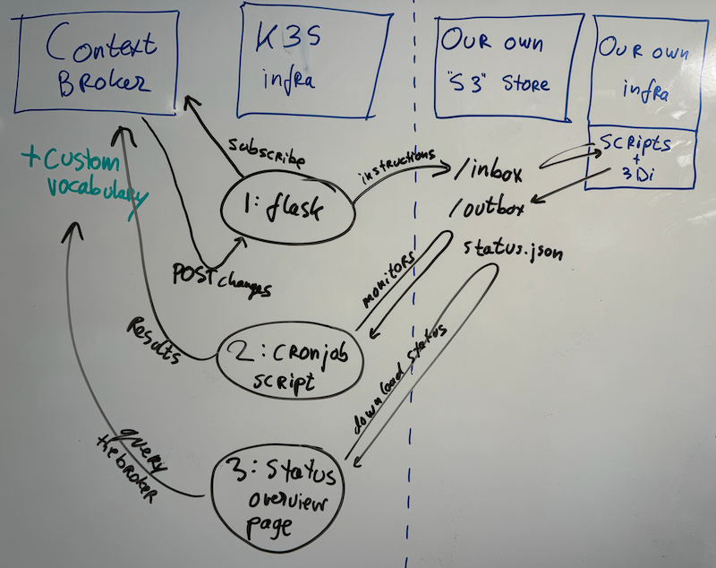

# Implementation & collaboration plan Nelen & Schuurmans

*Note beforehand: the information here is a technical programmer's view of what needs to be done :-) It might not be totally in sync with the project's terminology and plans.*

Within the [EU TEMA project](https://tema-project.eu/), [Nelen & Schuurmans](https://www.nelen-schuurmans.nl) is mainly involved with our [3Di hydrodynamic computation software](https://3diwatermanagement.com/), known as `PDM-tech-02` in the project. Our direct aim is to improve 3Di for disaster management.

Disaster management also means collaboration, of course. For that purpose, TEMA has provided infrastructure and technology suggestions as a framework for collaboration. The implementation plan in this document shows how we want to use the infrastructure to be able to show a nice realistic demo in cooperation with partners.

I hope this document also helps other partners to get started. For that purpose, it is my intention to keep most of the code open source (and thus visible). Some project-internal IP adresses and URLs will probably be hidden away in a private repo of course. You can email [reinout.vanrees@nelenschuurmans.nl](mailto:reinout.vanrees@nelen-schuurmans.nl) if you need access.

## Provided infrastructure

- A **context broker** implemented in [NGSI-LD](https://en.wikipedia.org/wiki/NGSI-LD). Basically a semantic web storage. I've written a [summary on my blog](https://reinout.vanrees.org/weblog/2024/04/16/tema-workshop-json-ld.html) of a TEMA workshop on that topic that should give a pretty good introduction. The context broker is the central information exchange mechanism for the whole project. If we need weather forecasts, we'll ask the CB to send us new ones added by other project partners. If we have flood calculation results, we'll put their info into the CB for others to query.
- **K3S**, a simple but powerful kubernetes cluster. According to what I gathered, you can connect your own kubernetes nodes but you can also use the provided infrastructure. You can use it to run servers or scripts, provided you "dockerize" them and know how to deploy those dockers to the cluster.

Both context broker ("CB") and the K3S cluster are hidden away behind a firewall, btw.

## Setup

The sketch below shows the suggested setup, followed by the textual explanation of the various parts. Basically we use the context broker in combination with a custom vocabulary + three **small and simple** dockers inside the K3S cluster + our own S3 storage for shuttling info back and forth.

## Context broker: custom vocabulary

In the context broker, we'll need to store information. Information that needs terms and definitions because of its "linked data" nature. So if we want to talk about a `RegionAtRisk`, we'll need to define.

If there's already a suitable vocabulary, we can use it. But at first we're probably better off making our own "JSON-LD" vocabulary for our specific use case. That way we can store `https://our.vocabulary.org/v1/meta/RegionAtRisk=Ahrtal` in the context broker and add a subscription to that.

We'll start such a bare-bones vocabulary and host it somewhere public. If handy, others can extend it or start their own.

Some initial ideas (all with proper urls instead of just words, of course):

    weather-occurrence
        id=abcd
        region = ahr
        timestamp = 2021-07-xx
        rainfall-data = s3://amaazon.com/xxx/something.tiff

    flood-calculation
        weather-occurrence=http://tema.it/weather-occurrence/abcd
        result=s3://amazon.com/s3/xxx/something.zip

    disturbance
        3di-scenario=https://www.3di.live/scenario/xyz
        height=235
        x1=...
        y1=...
        x2=...
        y2=...

## K3S part 1a: *context broker* target 'flask' docker

You can subscribe at the context broker for certain specific items. For instance a new `RegionAtRisk`. You have to provide a URL that the context broker can send its notification to.

We'll make a docker that contains a small [flask (python)](https://pypi.org/project/Flask/) webserver that serves as the "target URL" for the context broker. Apparently there already is a small example app available within the project, but I've only seen the filenames in a screenshot :-)

There's the technical detail of subscribing. It depends on the behaviour of the context broker. Perhaps we can just re-register ourselves when the flask server starts up?

(The flask docker will be registered through a kubernetes `deployment` yaml file. The details will have to be in some non-public repository, but once it works we'll probably put an example here.)

## K3S part 1b: what the 'flask' docker does

Custom scripting, installs of your own software: that's best handled on your own servers. At least, that's my line of thinking.

So the 'flask' docker does this:

- It gets the notifications from the context broker.
- It converts them into some json instruction.
- It uploads it to a company-specific S3 object store in an `inbox/` directory.
- (Afterwards, our custom software will look in that directory and start up 3Di simulations and so).

## K3S part 2: 'cronjob' script docker

The next part will be a docker running some python script. It is started as a kubernetes `cronjob` resource, which means it is simply run once in a while (every minute for instance).

The simple script will probably do this:

- Look in our company-specific S3 object store in the `outbox/` directory.
- Any messages/objects it finds there are posted to the context broker.

Such messages can be things like "area to really watch with drones".

This way, whatever we do or calculate or determine can be made available through the context broker. There is a possibility of storing blobs of data in an internal "minio" object store, but our guess is that it is handier to just provide the URL to our s3 store for the results we've calculated, as that will be a non-firewalled URL, btw.

## K3S part 3: status overview docker

To make the process visible/observable, we propose a simple web interface that shows the current status from our point of view:

- It downloads a `status.json` from our company-specific S3 object store.
- It shows what "our" infrastructure has received, what is being processed and what is ready.

This docker is deployed as a `deployment` resource with a matching `service` and `ingress`. (In normal terms: a website with a url).

## Summary

Our main focus is improving the actual "3Di" flood calcuation software. What I'm describing here is what we (and probably lots of other partners) need to do to cooperate:

- Find or make a good vocabulary for adding what we need to the *context broker*.
- A webserver that the context broker can send targeted messages to.
- A script that feeds the context broker (and possibly the META minio storage) with updated content.

## Possible case study

I'm throwing in [a possible case study](example-case-study/case-study.md) just to make the possible data flows a bit more concrete.
