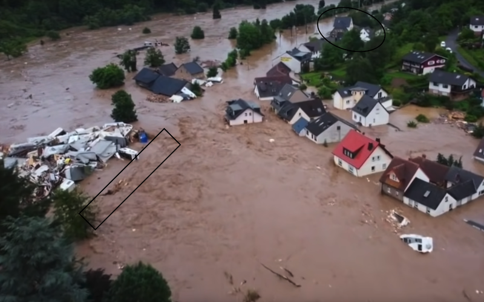
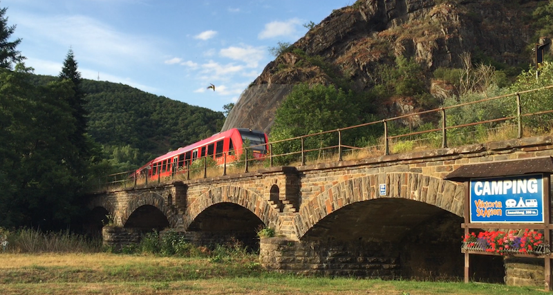
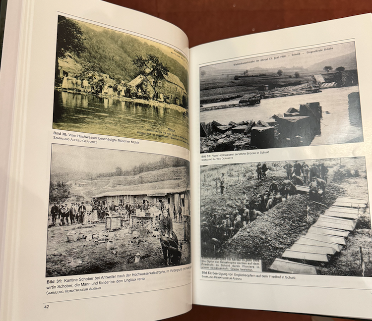

# Reinout's case study/proposal

Note: Reinout, who write this, hasn't heard anything about specific case studies, apart from "the Ahrtal floods in 2021". In order to write down the proposal contained in the `README.md` in this project, I had to come up with some case study as an example in order to figure out our (=Nelen & Schuurmans) project setup. This is just *my* example: perhaps useful as input for the project.

As it is "my" example/proposal, I get to keep this document personal :-)

- I'm interested in the project because of the *context broker*: it connects me to the *semantic web* from my PhD years.
- I'm very interested in railways in the Eifel region (of which the Ahrtal is a part). See [this youtube video](https://www.youtube.com/watch?v=EvDXScsPGvs) as an illustration.
- I've actually studied the 2021 floods in the Ahrtal quite a lot.

## 1: excessive rainfall is detected

The amount of rainfall was pretty well known beforehand. Lots of rain had already fallen, so the ground was soaked and couldn't absorb any additional rainfall. Then a Real Big Rainfall Event occurred...

For the demo, the rainfall events or predictions should be put into the context broker for us to be able to pick it up with 3Di.

## 2: flooding should be detected

Based upon a good model of the landscape and a good rainfall prediction (=our input), a reasonable prediction of flood levels (=our output) should be possible.

## 3: detection of critical locations

Based on the flood prediction, a prediction of critical locations could be made. I know N&S can do that, but perhaps a project partner can too. Flooding of railways, bridges or important roads ("Bundesstraße") or medical facilities comes to mind.

Such critical locations could really benefit of real-time drone imagery and monitoring. In reality, the upper reaches of the Ahr valley were crying for help while the authorities in the lower reaches were suspecting them of panick-making. Their own official downstream measurement equipment never went beyond a certain worrying level as the equipment literally stopped reporting after being ripped out by the flood...

Objective proper real-time flood calculations could really help here!

## 4: feedback from critical locatons

I invite you to look at [this video](https://youtu.be/I1MU2Kdnn_s?si=J34Duojrtz6BMhu_&t=75), at that timestamp you'll see below picture. The rectangular section at the bottom left is the submerged railway bridge, the round section at the top is the station building.

You'll notice half the camping site blocking the railway bridge arches. To make the situation clearer, here's a picture of the same bridge from my 2015 vacation:

So feedback from drones could really help. Ideally, they would be able to (perhaps with human intervention) detect that a previously-passable arched bridge was transformed into practically a dam.

Note that there are historical precedents for this situation! In 1910, one century earlier, a similar flood occurred. At that time, construction activities to extend the railway line in preparation of the first world war resulted in lots of driftwood that clogged many bridges in a similar destructive manner. See the pictures below (from the book "100 Jahre Dümpelfeld-Lissendorf-Jünkerath"):

