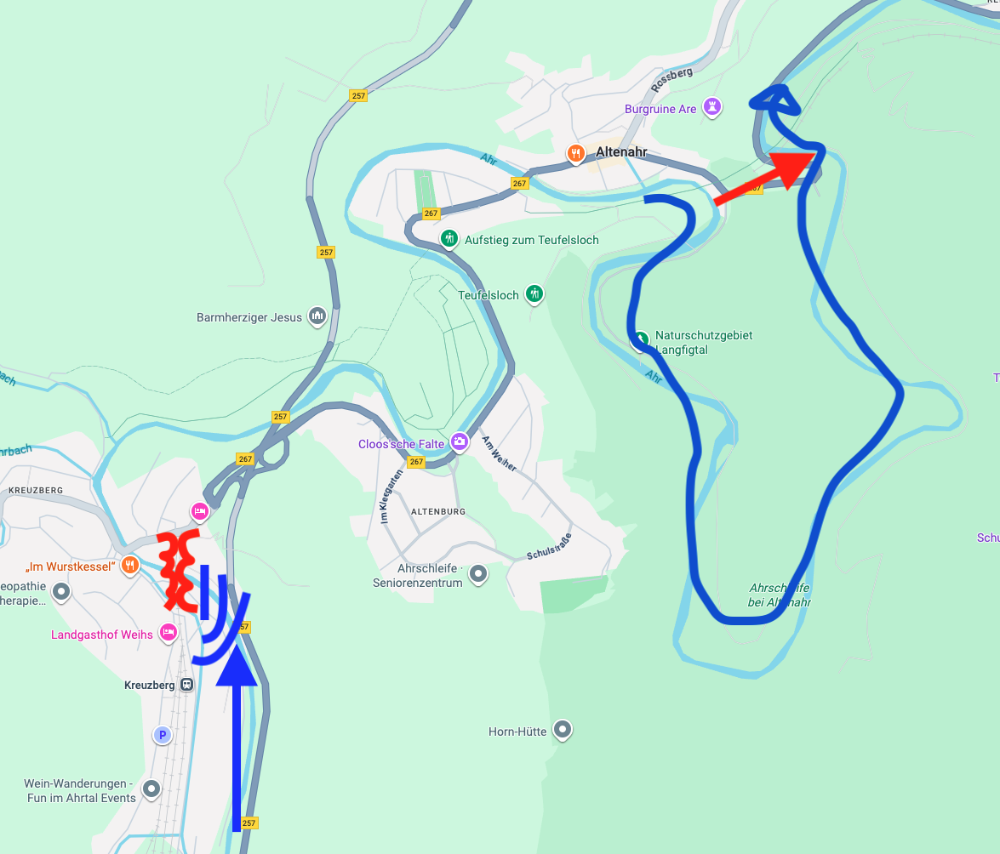

# Two possible case studies

Personally, I'm interested in trains and in the Eifel, so I've compiled two special cases near the study area:

- At the lower left, a railway bridge was blocked by caravans from nearby campsites, leading to a quite sudden raising of the flood level, trapping a train. See [Kreuzberg station case study](case-study.md).

- At the top right, a road tunnel provided a [shortcut for the river](shortcut-road-tunnel.md).
