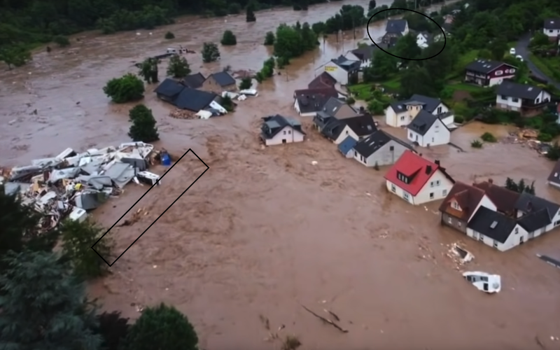
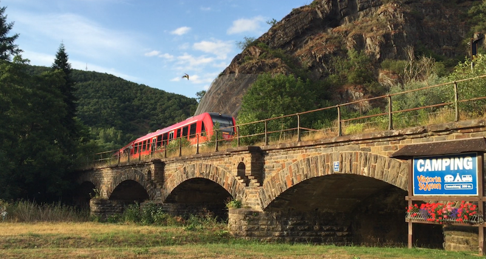
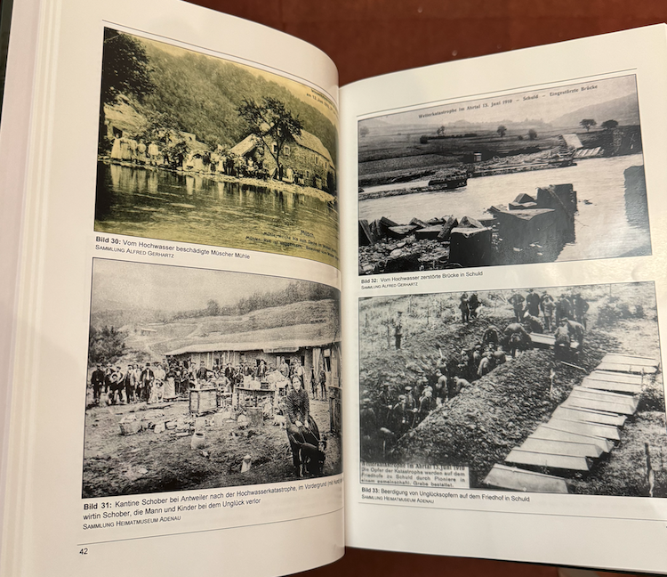
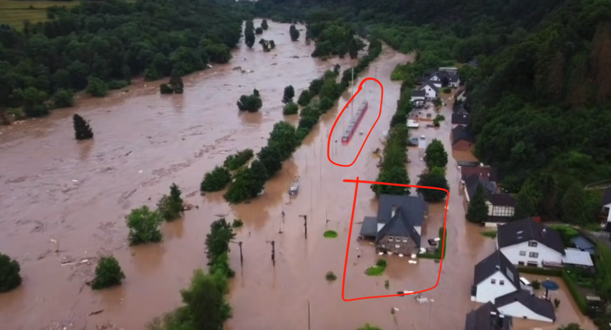

# Reinout's case study/proposal

Note: Reinout, who writes this, hasn't heard anything about specific case studies, apart from "the Ahrtal floods in 2021". In order to write down the proposal contained in the `README.md` in this project, I had to come up with some case study as an example in order to figure out our (=Nelen & Schuurmans) project setup. This is just *my* hypothetical example: perhaps useful as input for the project.

## 1: excessive rainfall is detected

The amount of rainfall in the "Ahr" region was pretty well known beforehand. Lots of rain had already fallen, so the ground was soaked and couldn't absorb any additional rainfall. Then a Real Big Rainfall Event occurred...

For the demo, the rainfall events or predictions should be put into the context broker for us to be able to pick it up with 3Di.

## 2: flooding should be detected

Based upon a good model of the landscape and a good rainfall prediction (=input for us), a reasonable prediction of flood levels (=output from us) should be possible.

## 3: detection of critical locations

Based on the flood prediction, a prediction of critical locations could be made. I know N&S can do that, but perhaps a project partner can too. Flooding of railways, bridges or important roads ("Bundesstraße") or medical facilities comes to mind.

Such critical locations could really benefit from real-time drone imagery and monitoring. In reality, the upper reaches of the Ahr valley were already dealing with a disaster even though the authorities in the lower reaches were not really aware of what was coming. Their own official downstream measurement equipment never went beyond a certain worrying level as the equipment literally stopped reporting after being ripped out by the flood...

Objective proper real-time flood calculations could really have helped here!

## 4: feedback from critical locatons

I invite you to look at [this video of Kreuzberg (Ahr)](https://youtu.be/I1MU2Kdnn_s?si=J34Duojrtz6BMhu_&t=75), at that timestamp you'll see below picture. The rectangular section at the bottom left is the submerged railway bridge, the round section at the top is the Kreuzberg station building.

You'll notice the camping site inventory piled up agains the now-submerged railway bridge arches. To make the situation clearer, here's a picture of the same bridge from my 2015 vacation (this is the downstream side of the bridge):

So feedback from drones could really help. Ideally, they would be able to (perhaps with human intervention) detect that a previously-water-passable arched bridge was transformed into practically a dam.

Note that there are historical precedents for this situation! [In 1910](https://en.wikipedia.org/wiki/1910_European_Floods), one century earlier, a similar flood occurred. At that time, construction activities to [extend the Ahr valley railway](https://en.wikipedia.org/wiki/D%C3%BCmpelfeld%E2%80%93Lissendorf_railway) line resulted in lots of drifting construction materials that clogged many bridges in a similar destructive manner. See the pictures below (from the book "100 Jahre Dümpelfeld-Lissendorf-Jünkerath"):

## 5: re-calculation based on new conditions

What was previously an arched bridge might be turned into practically a dam due to tree branches and especially campers from the camping site blocking the arches. This can be detected with drones **and fed back into 3Di**.

Such a "dam" instead of a bridge will of course rapidly increase the upstream water levels. Timely warnings might be handy.

## 6: reality

In reality, no real warnings were issued. I personally assumed that the railway traffic, for instance, would have been stopped hours before matters got extreme. That was evidently not the case if we look at the Kreuzberg example.

According to [this German forum message](https://www.eifelbahnforum.de/viewtopic.php?t=6396), the following occured:

*Deutlich unangenehmer und gefährlicher wurde es übrigens für den Tfz-Führer des 620 045 in Kreuzberg/Ahr. Er hatte mit seinem Zug gerade den Bahnhof in Rtg. Remagen verlassen, als er sah, wie vor ihm die Ahrbrücke weggespült wurde. Eine Weiterfahrt war unmöglich. Er wechselte ans andere Zugende und sagte der Zugführerin Bescheid, sie solle die Reisenden schon mal im nahe gelegenen DB-Haus in Sicherheit bringen (das Bahnhofsgebäude war außer Betrieb). Als er den Zug abgestellt und gesichert hatte, stand das Wasser ebenfalls schon bis zu den Armlehnen der Sitze, aber anders als in Rheinbach mit starker Strömung und gefährlichem Treibgut. Durch eine geöffnete Tür konnte er sich zunächst auf eine Garage retten, aber die Flut stieg immer weiter und die Garage erzitterte schon, so dass er auf einen tief hängenden Ast klettern musste. Dort verbrachte er die nächsten 18 Stunden immer in der Angst, herunterzufallen oder der Baum würde auch weggespült.*

Translated, a train departed the Kreuzberg station (the circle in the first picture, the square below) and the train driver noticed just in time that the bridge (the rectangle in the first image) had broken down... He backed up the train a few hundred meters and debarked the passengers. He even parked the train neatly on one of the side tracks (oval in the image below). Afterwards he had to escape due to the fast moving water to the top of a garage and later to a tree branch where he had to spend the next 18 hours...

According to answers I got, the aformentioned train was probably scheduled to leave the station between 19:30 and 20:00. This could perhaps be used in the demo! My initial idea was to omit the train bridges from the equation "as the trains would have been shut down already", but apparently I was wrong.

## 7: possible result

The result could be something like this:

- The predicted rainfall results in some pretty worrying simulated water levels in the Ahr valley.
- The simulated water levels prompt drone activity, which result in changed characteristics of several bridges (turning them from partially-open bridges into practically dams)
- The "dams" result in rapidly rising water levels, resulting in warnings for blocked main traffic arteries like the Ahrtalbahn.
